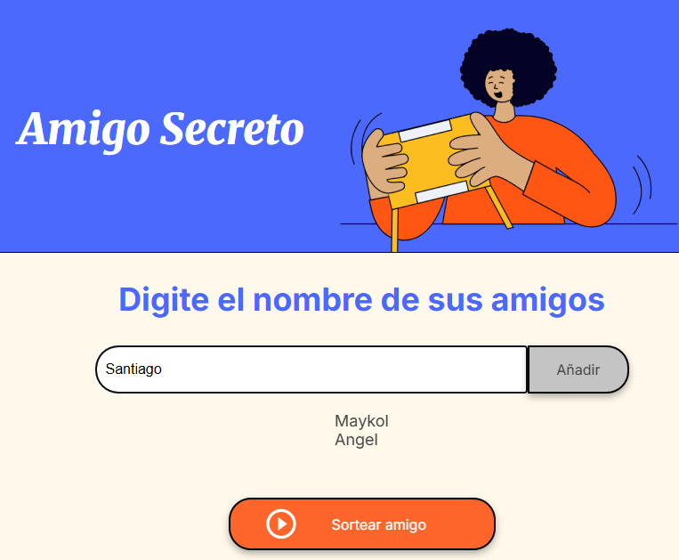
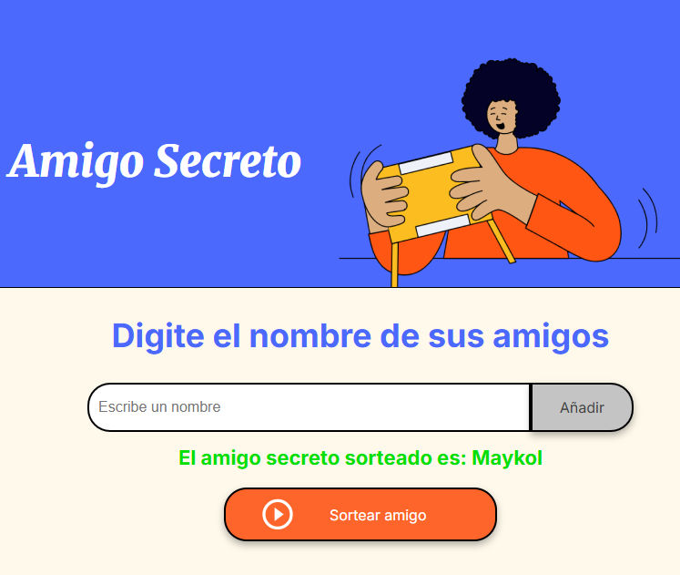
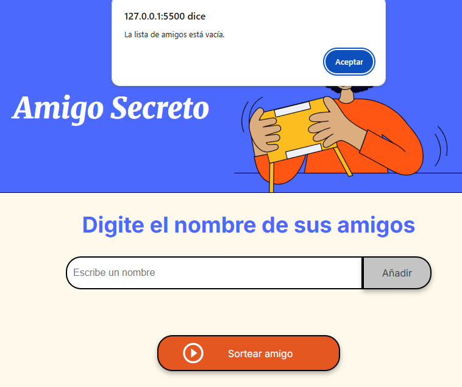
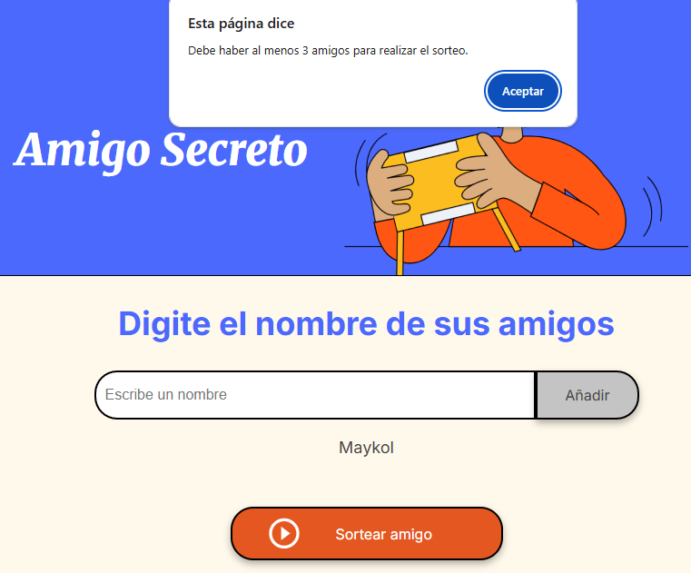
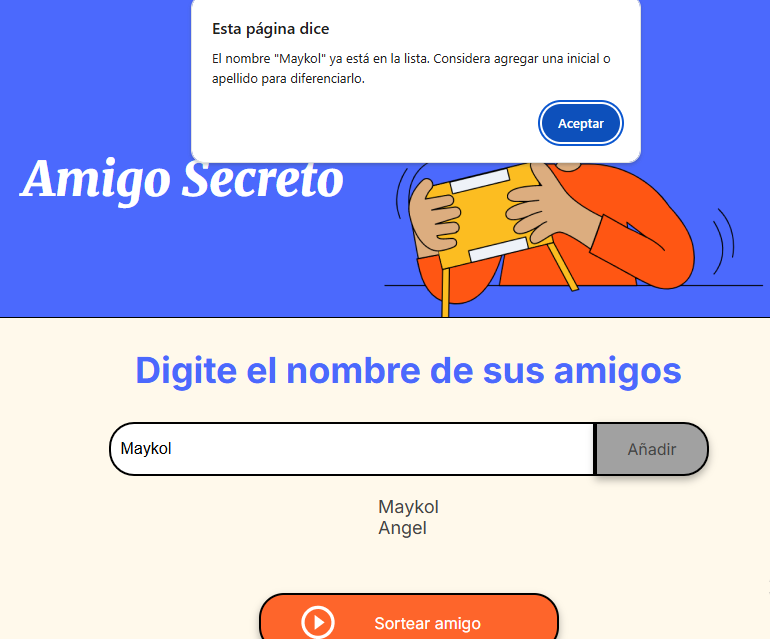

# Amigo Secreto
"Aplicación web para sortear un amigo secreto"
## Funcionalidades  
- Agregar nombres de participantes.  
- Validar que los nombres no se repitan.  
- Mostrar la lista de amigos agregados.  
- Sortear un amigo secreto aleatoriamente.  
- Desactivar los botones después del sorteo.
## Capturas del Proyecto 
### Agregar nombres
En esta sección, el usuario puede ingresar los nombres de los participantes en el campo de entrada y agregarlos a la lista.
  
---
### Sorteo de amigo secreto
Una vez que se han agregado suficientes participantes, el usuario puede realizar el sorteo y se mostrará el nombre de la persona seleccionada.
  
---
### Advertencias
El sistema muestra diferentes alertas en caso de que se presenten errores al ingresar nombres o realizar el sorteo.
- Campo vacío:Se muestra esta advertencia si el usuario intenta agregar un nombre sin haber escrito nada en el campo de entrada.
  
    

- Lista vacía:Si el usuario intenta sortear sin haber agregado nombres, aparecerá esta alerta.    
    

- Mínimo de participantes:Se requiere un mínimo de tres participantes para realizar el sorteo. Si hay menos, se mostrará esta advertencia.  
    

- Nombre repetido:Si el usuario ingresa un nombre que ya está en la lista, el sistema le pedirá que agregue una inicial adicional o elija otro nombre.  
    
---
## Archivos en el proyecto  
- `index.html` → Contiene la estructura de la página.  
- `style.css` → Estilos para la interfaz.  
- `app.js` → Lógica para agregar amigos y realizar el sorteo.
## Cómo usarlo  
1. Agrega nombres en el campo de texto y presiona "Añadir".  
2. Una vez agregados al menos 3 nombres, haz clic en "Sortear amigo".  
3. El sistema mostrará el amigo secreto y desactivará los botones. 

